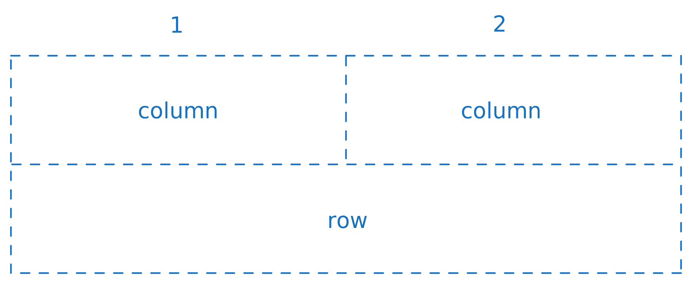
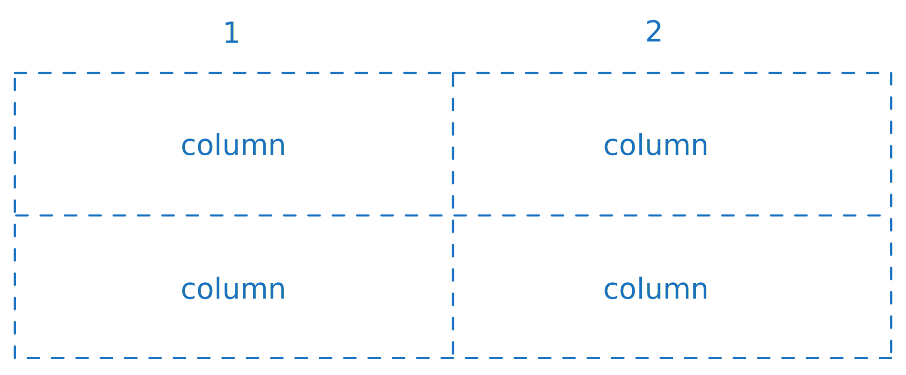
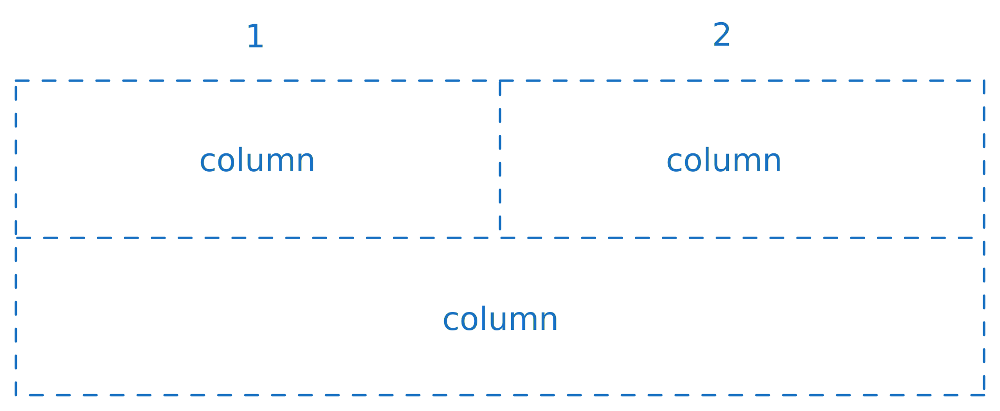
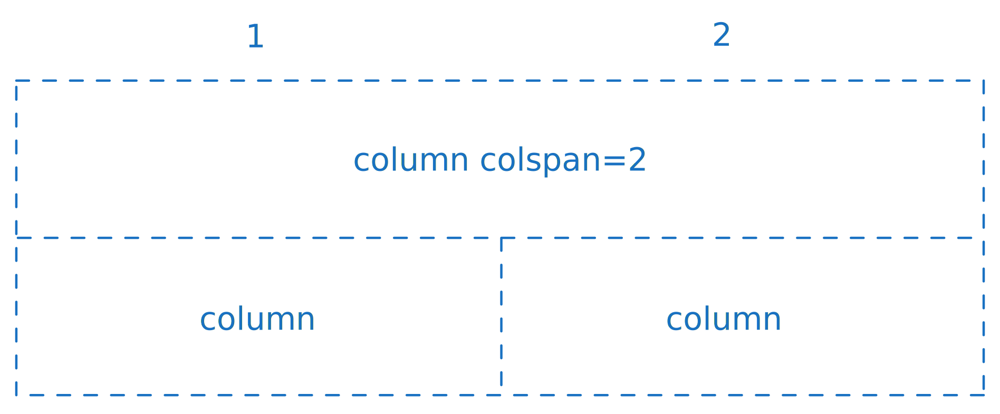
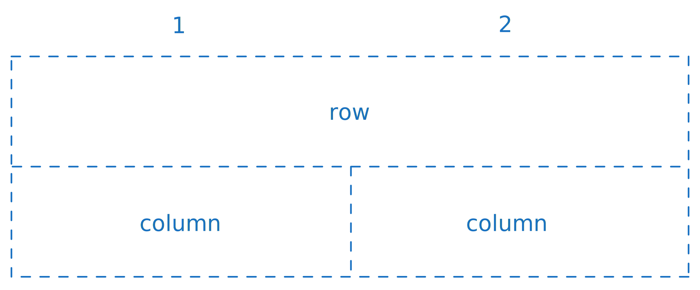
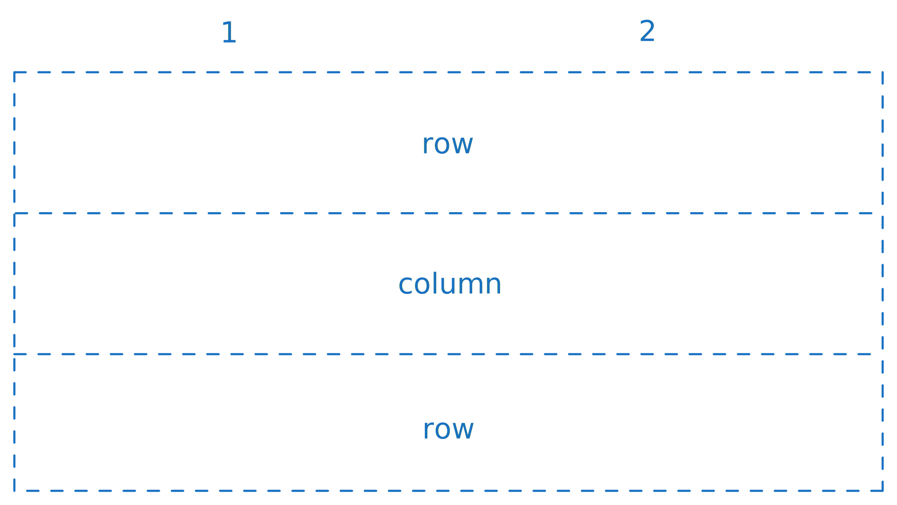

# Templates

Templates describe how each work item type should be rendered on the output. The goal for the templating system is to be flexible enough to adapt to most common use cases, while still remaining simple enough.

::: info TODO
In the future, ship out-of-the-box templates for the most common work item types, as well as a generic template for all work item types that have no specific template.
For now, you need to create a template for every work item you wish to use in your backlog.
:::

A template can be described by the work item type it applies to, and the list of blocks that it contains. Blocks are reusable pieces of content that can be used to display information about the work item. Each block type will have different properties and render differently:
 - **[Metadata](#metadata)** basic table-like structure to display other blocks inside of it, useful for displaying metadata at the top of each work item
 - **[Section](#section)** render the contents of a generic field of the work item
 - **[Links](#links)** display links to related work items that are also part of this backlog
 - **[Tags](#tags)** displays the list of tags assigned to the work item

::: tip
To reduce visual clutter, most blocks hide themselves if they are empty. For example, if a work item has no tags, then the field does not appear at all.

Likewise, blocks that contain other blocks (such as columns and rows), will hide themselves if their child blocks are hidden.
:::

```kdl:line-numbers
template "User Story" {
    metadata columns=2 {
        column { section header="Iteration" field="System.IterationPath"; }
        column { section header="Story Points" field="Microsoft.VSTS.Scheduling.StoryPoints"; }

        column { section header="State" field="System.State"; }
        column { section header="Modified" field="System.ChangedDate"; }

        row { links label="Feature" single=true "System.LinkTypes.Hierarchy-Reverse"; }

        row { tags; }
    }

    section field="System.Description" richText=true

    section header="Risks / Pending" field="Custom.RisksPending" richText=true

    section header="Acceptance Criteria" field="Microsoft.VSTS.Common.AcceptanceCriteria" richText=true

    section header="Release Notes" field="Project.ReleaseNotes" richText=true
}
```

## Metadata
A table-like block. You can configure how many columns it will have, and based on that, as well as on the blocks inside of it, it distribute them across as many rows as needed.

```kdl:line-numbers
metadata columns=2 {
    column { ... }
    column { ... }
    row { ... }
}
```

This example configuration, would end up with two rows, for example, as described below.

{.light-only}
{.dark-only}

### Column
Each `column`, by default, takes up one cell space. If the table has 2 columns, it means we can fit 2 in 1 row, 4 in 2 rows, and so on.

```kdl:line-numbers
metadata columns=2 {
    column { ... }
    column { ... }
    column { ... }
    column { ... }
}
```

{.light-only}
{.dark-only}

There is, however, one exception. And that is when the column is the last block in it's row. In those cases, it will take up all the remaining horizontal space left, if any. That means, the following configuration would produce the last `column` spanning two columns.

```kdl:line-numbers
metadata columns=2 {
    column { ... }
    column { ... }
    column { ... }
}
```

{.light-only}
{.dark-only}

As we can see, the last column spans the entire table. However, what if we wanted to flip it around, and have the first row span the entire table? We can do that, by using the `colspan` property forcing the first column to span 2 columns instead of just one.


```kdl:line-numbers
metadata columns=2 {
    column colspan=2 { ... } // [!code hl]
    column { ... }
    column { ... }
}
```

{.light-only}
{.dark-only}

### Row
The last example we saw, of putting a column that spans the entire width of the table, is quite common. For that reason, there is a specific block that you can use, called `row`.
It is functionally equivalent to putting a `column` with the same `colspan` as the total number of columns on the table, with the advantage that, since you don't need to specify the `colspan` property, if you change the number of columns of the table, it will still take up the entire horizontal space.

```kdl:line-numbers
metadata columns=2 {
    row { ... } // [!code hl]
    column { ... }
    column { ... }
}
```

{.light-only}
{.dark-only}

Since a row always requires the full width of the table to be displayed, if you start a row in the middle of the table, it will break and start on the next line. This creates a sort of vacuum, an empty slot, that pulls the last element to fill that void. That means, for example, that in this scenario, the column would implicitly take up 2 columns, even though it has no explicit `colspan` property telling it to do so.

```kdl:line-numbers
metadata columns=2 {
    row { ... }
    column { ... } // [!code hl]
    row { ... }
}
```

{.light-only}
{.dark-only}

::: details Reasons for the Layout System
You might wonder why the need for such a dynamic system? The main reason is that, since columns and rows collapse (are not displayed) for a particular work item, when rendering, if their content is empty.

This means that sometimes one column might not be displayed, or multiple, or entire rows. The system tries to compensate for that, always by respecting the minimum size required, and expanding to fill any empty spaces it finds.

Take the example above. It might seem weird to have one column in the middle of two rows, instead of simply three rows, right? Well, in practice, it can happen even if you had two columns, but one of them was empty.
```kdl:line-numbers
metadata columns=2 {
    row { ... }
    column { ... }
    column { empty } // [!code ++]
    row { ... }
}
```
:::

## Section
So far we have seen how we can layout columns and rows on the `metadata` element. But by itself, it does not display anything.

One of the most useful blocks is the `section`, which displays the contents of a Work Item's field. It has some properties to configure its behavior:
- **`field`** mandatory, indicates which field of the Work Item to display
- **`header`** label/header to show next to the value. If empty, only the value is shown (defaults to `null`)
- **`richText`** boolean flag to indicate if this field contains simple text or formatted text (defaults to `false`)

```kdl:line-numbers
template "User Story" {
    metadata columns=2 {
        column { section header="Iteration" field="System.IterationPath"; } // [!code ++]
    }

    section field="System.Description" richText=true // [!code ++]
}
```

::: info
Inside the brackets `column { ... }` on a single line, we need to add a semi-colon `;` at the end of the `field`, for the KDL parser to be able to understand when it ends.

However, the `field` tag stands on its own line, we do not need to do so.
::: 

## Links
The `links` tag can be used to display related work items of the user story. Note that those work items must be included in the backlog for them to be properly displayed here.

The tag has the following properties:
 - **`label`** A value to display next to the link(s) of the work item(s)
 - **`single`** Optional value, indicating if we want to display only the first relation of this kind (when `true`), or a list of relations (when `false`). Defaults to `true`

Additionally, it requires as it's main argument, the name of the relation to display. Most commonly, these will be:
 - `System.LinkTypes.Hierarchy-Reverse` for the parent relation
 - `System.LinkTypes.Hierarchy-Forward` for the children relations

```kdl:line-numbers
template "Feature" {
    metadata columns=2 {
        row { links label="Epic" "System.LinkTypes.Hierarchy-Reverse" single=true; } // [!code ++]
    }

    links label="User Stories" "System.LinkTypes.Hierarchy-Forward" // [!code ++]
}
```

Also note that you are not limited to displaying the elements only one level up/down, but as many levels as you want. For example, we can display the **Epic** associated with a user story, instead of it's **Feature**, by passing the parent relation name twice:

```kdl:line-numbers
template "User Story" {
    metadata columns=2 {
        row { links label="Feature" "System.LinkTypes.Hierarchy-Reverse" single=true; } // [!code --]
        row { links label="Epic" "System.LinkTypes.Hierarchy-Reverse" "System.LinkTypes.Hierarchy-Reverse" single=true; } // [!code ++]
    }
}
```

Similarly, we can display the list of **User Stories** and **Bugs** associated with an **Epic**, instead of it's **Features**, like so:
```kdl:line-numbers
template "Epic" {
    links label="Features" "System.LinkTypes.Hierarchy-Forward" // [!code --]
    links label="User Stories & Bugs" "System.LinkTypes.Hierarchy-Forward" "System.LinkTypes.Hierarchy-Forward" // [!code ++]
}
```

::: details Placement of Parent and Children links
Note that it is common to configure parent relations to be displayed with `single=true`. This is only a convention, since normally each work item can only have one parent. 
You could still display them as lists, although they would always be lists of at most one element.

Similarly, you may notice in the examples that the parent relations are rendered inside `template > metadata > row`, whereas children relations are rendered directly inside the `template` tag.
This is not mandatory, and is simply a convention to display the parent links on the metadata section of the work item, normally near its top, and the children after the body of the work item, normally near its bottom. But you can choose to render them however you see fit.
:::

## Tags

The `tags` block renders the list of tags assigned to the work item.

```kdl:line-numbers
template "User Story" {
    metadata columns=2 {
        row { tags; } // [!code ++]
    }
}
```